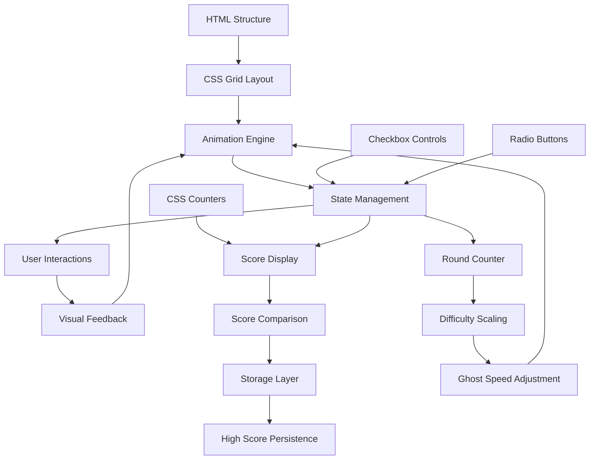

# Design Document

## Overview

The CSS-only Pacman game leverages advanced CSS techniques to create an interactive gaming experience without JavaScript. The architecture uses a combination of CSS Grid for layout, CSS animations for movement, checkbox/radio button state management for user input, and complex selectors for game logic. The design prioritizes smooth animations, responsive interactions, and faithful recreation of classic Pacman mechanics while maintaining clean, semantic HTML structure.

The core innovation lies in using hidden form controls to manage game state, CSS counters for scoring, and layered positioning for collision detection. All character movements are achieved through CSS transforms and transitions, while game logic is handled via cascading selectors that respond to input states.

## Architecture

The game consists of five main architectural layers:

1. **HTML Structure Layer**: Semantic markup defining game board, characters, and control elements
2. **CSS Layout Layer**: Grid-based maze layout with positioned game elements
3. **Animation Engine Layer**: Keyframe animations and transitions for character movement
4. **State Management Layer**: Hidden form controls and CSS selectors for game logic
5. **Storage Layer**: Minimal JavaScript module for persistent high score storage



## Components and Interfaces

### Game Board Component

**Purpose**: Defines the maze structure and game boundaries
**Implementation**: CSS Grid with named grid areas for walls and pathways
**Interface**:

```css
.game-board {
  display: grid;
  grid-template-columns: repeat(21, 1fr);
  grid-template-rows: repeat(21, 1fr);
  gap: 2px;
}
```

**Responsibilities**:

- Define maze layout using grid positioning
- Provide collision boundaries through grid constraints
- Support responsive scaling for different screen sizes

### Pacman Character Component

**Purpose**: Player-controlled character with directional movement and eating animation
**Implementation**: Positioned div with CSS transforms and keyframe animations
**Interface**:

```css
.pacman {
  position: absolute;
  width: 20px;
  height: 20px;
  border-radius: 50%;
  background: #ffff00;
  transform: translate(var(--x), var(--y)) rotate(var(--direction));
  transition: transform 0.3s ease-in-out;
}
```

**Responsibilities**:

- Respond to directional input controls
- Animate mouth opening/closing during movement
- Handle collision detection with dots and ghosts
- Maintain position within maze boundaries

### Ghost Components

**Purpose**: Autonomous enemy characters with AI-like movement patterns
**Implementation**: Four separate positioned elements with staggered animations
**Interface**:

```css
.ghost {
  position: absolute;
  width: 20px;
  height: 20px;
  border-radius: 50% 50% 0 0;
  animation: ghost-move var(--speed) linear infinite;
  background: var(--ghost-color);
}
```

**Responsibilities**:

- Move automatically through predefined paths
- Change behavior during power pellet mode
- Provide collision detection with Pacman
- Display vulnerability state with color changes

### Control System Component

**Purpose**: Manages user input and game state without JavaScript
**Implementation**: Hidden radio buttons and checkboxes with CSS selectors
**Interface**:

```html
<input type="radio" name="direction" id="up" class="control-input" />
<input
  type="radio"
  name="direction"
  id="down"
  class="control-input"
/>
<input
  type="radio"
  name="direction"
  id="left"
  class="control-input"
/>
<input
  type="radio"
  name="direction"
  id="right"
  class="control-input"
/>
<input type="checkbox" id="power-mode" class="power-state" />
```

**Responsibilities**:

- Capture keyboard/click input for movement
- Maintain current direction state
- Toggle power pellet mode
- Trigger game state changes

### Scoring System Component

**Purpose**: Tracks and displays game score using CSS counters with persistent high score storage
**Implementation**: CSS counters with content generation and minimal JavaScript for localStorage
**Interface**:

```css
body {
  counter-reset: score 0 lives 3 round 1;
}
.score::after {
  content: counter(score);
}
.high-score::after {
  content: attr(data-high-score);
}
.round::after {
  content: counter(round);
}
```

**Responsibilities**:

- Increment score when dots/ghosts are consumed
- Display current score and high score in real-time
- Track current round progression (1-20)
- Handle round advancement and difficulty scaling
- Persist high scores to browser localStorage
- Handle game completion after round 20

### Round Progression Component

**Purpose**: Manages multi-round gameplay with increasing difficulty
**Implementation**: CSS counters and custom properties for difficulty scaling
**Interface**:

```css
:root {
  --current-round: 1;
  --ghost-speed: calc(2s - (var(--current-round) * 0.05s));
  --max-rounds: 20;
}
.round-display::after {
  content: 'Round ' counter(round) ' / 20';
}
```

**Responsibilities**:

- Track current round (1-20)
- Increase ghost movement speed each round
- Reset maze dots for new rounds
- Display round progression to player
- Trigger game completion after round 20

### Storage Management Component

**Purpose**: Handles persistent high score storage using browser localStorage
**Implementation**: Minimal JavaScript module for storage operations only
**Interface**:

```javascript
const ScoreStorage = {
  getHighScore: () =>
    localStorage.getItem('pacman-high-score') || '0',
  setHighScore: (score) =>
    localStorage.setItem('pacman-high-score', score),
  isAvailable: () => typeof Storage !== 'undefined',
};
```

**Responsibilities**:

- Save high scores to localStorage
- Retrieve stored high scores on game load
- Handle localStorage unavailability gracefully
- Provide fallback for browsers without storage support

## Data Models

### Game State Model

```css
:root {
  --pacman-x: 10;
  --pacman-y: 15;
  --pacman-direction: 0deg;
  --game-state: playing; /* playing, paused, game-over, victory, round-complete, game-complete */
  --power-mode: inactive; /* active, inactive */
  --current-score: 0;
  --high-score: 0;
  --lives: 3;
  --current-round: 1;
  --max-rounds: 20;
  --ghost-base-speed: 2s;
  --ghost-speed-multiplier: calc(1 - (var(--current-round) * 0.025));
}
```

### Round Progression Model

```css
.round-system {
  --dots-remaining: 244; /* Total dots in maze */
  --round-complete: calc(var(--dots-remaining) == 0 ? 1: 0);
  --game-complete: calc(
    var(--current-round) >= var(--max-rounds) ? 1: 0
  );
}
```

### High Score Model

```html
<div class="score-display">
  <div class="current-score" data-score="0">
    Score: <span class="score-value"></span>
  </div>
  <div class="high-score" data-high-score="0">
    High Score: <span class="high-score-value"></span>
  </div>
  <div class="round-display">
    Round: <span class="round-value"></span> / 20
  </div>
</div>
```

### Maze Layout Model

The maze is represented as a CSS Grid with specific cell types:

- **Wall cells**: `grid-area` with solid background
- **Path cells**: Empty grid areas for movement
- **Dot cells**: Path cells with `::before` pseudo-elements
- **Power pellet cells**: Special dots with larger size and glow effect

### Character Position Model

```css
.character {
  --grid-x: 10;
  --grid-y: 15;
  --pixel-x: calc(var(--grid-x) * 25px);
  --pixel-y: calc(var(--grid-y) * 25px);
  transform: translate(var(--pixel-x), var(--pixel-y));
}
```

## Error Handling

### Movement Collision Prevention

**Strategy**: Use CSS `calc()` functions to constrain movement within valid grid cells
**Implementation**:

```css
.pacman {
  --max-x: calc(var(--maze-width) - 1);
  --max-y: calc(var(--maze-height) - 1);
  --constrained-x: max(0, min(var(--grid-x), var(--max-x)));
  --constrained-y: max(0, min(var(--grid-y), var(--max-y)));
}
```

### Invalid State Recovery

**Strategy**: CSS fallback values and default states
**Implementation**:

- Default to center position if invalid coordinates
- Reset to normal mode if power pellet timer expires
- Maintain minimum score of 0 using CSS `max()` functions

### Animation Performance Optimization

**Strategy**: Use `transform` and `opacity` properties for smooth animations
**Implementation**:

- Avoid animating layout-triggering properties
- Use `will-change` property for performance hints
- Implement hardware acceleration with `transform3d()`

## Testing Strategy

### Visual Regression Testing

- Compare rendered game states across different browsers
- Verify maze layout consistency at various screen sizes
- Test animation smoothness and timing accuracy

### Interaction Testing

- Validate all movement controls function correctly
- Ensure dot collection updates score appropriately
- Verify collision detection between characters

### Performance Testing

- Monitor CSS animation frame rates
- Test game responsiveness during intensive animations
- Validate memory usage with long-running sessions

### Cross-Browser Compatibility

- Test on modern browsers (Chrome, Firefox, Safari, Edge)
- Verify CSS Grid and Flexbox support
- Ensure consistent animation performance

### Accessibility Testing

- Verify keyboard navigation works for all controls
- Test with screen readers for semantic structure
- Ensure sufficient color contrast for visually impaired users

## Implementation Notes

### CSS-Only Movement Limitation

Since CSS cannot directly respond to keyboard events, the design uses labeled radio buttons that can be triggered with keyboard navigation (Tab + Space/Enter). This provides the closest approximation to real-time keyboard control in a CSS-only environment.

### Collision Detection Approach

Collision detection relies on overlapping positioned elements and CSS selectors. When Pacman's position matches a dot's position (using CSS `calc()` comparisons), the dot element becomes hidden and the score counter increments.

### Ghost AI Simulation

Ghost movement is achieved through predefined CSS animation paths with staggered timing delays. Each ghost follows a different animation sequence to create the illusion of intelligent behavior.

### Round Progression Implementation

Round advancement is handled through CSS counters and custom properties. When all dots are collected (tracked via CSS counters), the round counter increments and ghost speed variables are recalculated. The maze resets by toggling visibility classes on dot elements.

### Storage Integration Strategy

High score persistence requires minimal JavaScript integration while maintaining the CSS-only game logic. The storage module operates independently, only interfacing with the game during score comparison and persistence events. This preserves the core CSS-only architecture while adding essential persistence functionality.

### Performance Considerations

The design minimizes DOM manipulation by using CSS transforms exclusively for movement, ensuring smooth 60fps animations. All state changes occur through CSS class toggles and selector cascading rather than DOM element creation/destruction. Round progression and difficulty scaling use CSS custom property calculations to avoid JavaScript performance overhead during gameplay.
