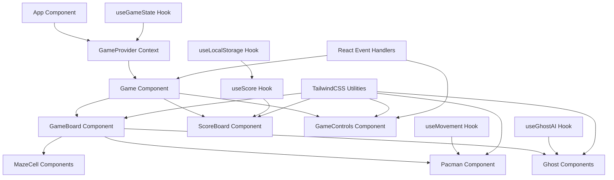

# Design Document

## Overview

The React Pacman game is built as a modern single-page application using React 18+ with functional components and hooks, styled entirely with TailwindCSS utilities. The architecture emphasizes component composition, declarative state management, and responsive design patterns. The game leverages React's virtual DOM for efficient updates, custom hooks for game logic encapsulation, and TailwindCSS's utility-first approach for consistent styling and animations.

The design centers around a main Game component that orchestrates child components (GameBoard, Pacman, Ghosts, ScoreBoard, GameControls) through props and context. All game state is managed through React hooks, with custom hooks abstracting complex game mechanics like collision detection, AI behavior, and score management. TailwindCSS provides all styling, animations, and responsive behavior through utility classes.

## Architecture

The React Pacman game follows a layered component architecture with clear separation of concerns:

1. **Presentation Layer**: React functional components with TailwindCSS styling
2. **State Management Layer**: Custom hooks and React Context for global state
3. **Game Logic Layer**: Custom hooks encapsulating game mechanics and rules
4. **Event Handling Layer**: React event handlers and keyboard/touch input management
5. **Persistence Layer**: localStorage integration through custom hooks



## Components and Interfaces

### GameBoard Component

**Purpose**: Defines the maze structure and game boundaries
**Implementation**: React component with TailwindCSS Grid layout
**Interface**:

```jsx
const GameBoard = ({ maze, pacman, ghosts, onCellClick }) => {
  return (
    <div className="grid grid-cols-21 grid-rows-21 gap-0.5 p-2 bg-black border-4 border-blue-600 rounded-lg">
      {maze.map((row, y) =>
        row.map((cell, x) => (
          <MazeCell
            key={`${x}-${y}`}
            type={cell}
            x={x}
            y={y}
            onClick={() => onCellClick(x, y)}
          />
        ))
      )}
      <Pacman {...pacman} />
      {ghosts.map((ghost) => (
        <Ghost key={ghost.id} {...ghost} />
      ))}
    </div>
  );
};
```

**Responsibilities**:

- Render maze layout using TailwindCSS Grid
- Manage maze cell components and their states
- Handle click events for debugging/testing
- Support responsive scaling with TailwindCSS responsive utilities

### Pacman Component

**Purpose**: Player-controlled character with directional movement and eating animation
**Implementation**: React component with TailwindCSS styling and animations
**Interface**:

```jsx
const Pacman = ({ x, y, direction, isMoving, isEating }) => {
  const directionClasses = {
    up: 'rotate-[-90deg]',
    down: 'rotate-90',
    left: 'rotate-180',
    right: 'rotate-0',
  };

  return (
    <div
      className={`
        absolute w-6 h-6 bg-yellow-400 rounded-full
        transition-all duration-300 ease-in-out
        ${directionClasses[direction]}
        ${isMoving ? 'animate-pulse' : ''}
        ${isEating ? 'animate-bounce' : ''}
      `}
      style={{
        transform: `translate(${x * 24}px, ${y * 24}px)`,
      }}
    >
      <div className="w-full h-full relative">
        <div className="absolute inset-0 bg-yellow-400 rounded-full animate-ping opacity-75" />
      </div>
    </div>
  );
};
```

**Responsibilities**:

- Render Pacman character with TailwindCSS styling
- Handle directional rotation and movement animations
- Display eating and movement state animations
- Maintain position through React props

### Ghost Components

**Purpose**: Autonomous enemy characters with AI-like movement patterns
**Implementation**: Four separate positioned elements with staggered animations
**Interface**:

```css
.ghost {
  position: absolute;
  width: 20px;
  height: 20px;
  border-radius: 50% 50% 0 0;
  animation: ghost-move var(--speed) linear infinite;
  background: var(--ghost-color);
}
```

**Responsibilities**:

- Move automatically through predefined paths
- Change behavior during power pellet mode
- Provide collision detection with Pacman
- Display vulnerability state with color changes

### GameControls Component

**Purpose**: Manages user input and game interactions
**Implementation**: React component with event handlers and keyboard listeners
**Interface**:

```jsx
const GameControls = ({ onDirectionChange, onPause, onRestart }) => {
  useEffect(() => {
    const handleKeyPress = (event) => {
      switch (event.key) {
        case 'ArrowUp':
        case 'w':
          onDirectionChange('up');
          break;
        case 'ArrowDown':
        case 's':
          onDirectionChange('down');
          break;
        case 'ArrowLeft':
        case 'a':
          onDirectionChange('left');
          break;
        case 'ArrowRight':
        case 'd':
          onDirectionChange('right');
          break;
        case ' ':
          onPause();
          break;
        case 'r':
          onRestart();
          break;
      }
    };

    window.addEventListener('keydown', handleKeyPress);
    return () =>
      window.removeEventListener('keydown', handleKeyPress);
  }, [onDirectionChange, onPause, onRestart]);

  return (
    <div className="fixed bottom-4 right-4 flex flex-col gap-2">
      <button
        onClick={() => onDirectionChange('up')}
        className="bg-blue-600 text-white p-3 rounded-lg hover:bg-blue-700 transition-colors"
      >
        ↑
      </button>
      <div className="flex gap-2">
        <button
          onClick={() => onDirectionChange('left')}
          className="bg-blue-600 text-white p-3 rounded-lg hover:bg-blue-700 transition-colors"
        >
          ←
        </button>
        <button
          onClick={() => onDirectionChange('down')}
          className="bg-blue-600 text-white p-3 rounded-lg hover:bg-blue-700 transition-colors"
        >
          ↓
        </button>
        <button
          onClick={() => onDirectionChange('right')}
          className="bg-blue-600 text-white p-3 rounded-lg hover:bg-blue-700 transition-colors"
        >
          →
        </button>
      </div>
    </div>
  );
};
```

**Responsibilities**:

- Handle keyboard input for movement
- Provide touch/click controls for mobile
- Manage pause and restart functionality
- Trigger game state changes through callbacks

### ScoreBoard Component

**Purpose**: Tracks and displays game score with persistent high score storage
**Implementation**: React component with hooks for state management and localStorage
**Interface**:

```jsx
const ScoreBoard = ({
  score,
  highScore,
  lives,
  round,
  gameState,
}) => {
  return (
    <div className="flex justify-between items-center w-full max-w-2xl bg-gradient-to-r from-blue-800 to-blue-600 text-yellow-400 p-4 rounded-lg border-2 border-yellow-400 shadow-lg">
      <div className="flex flex-col items-center">
        <span className="text-lg font-bold">SCORE</span>
        <span className="text-2xl font-mono">
          {score.toLocaleString()}
        </span>
      </div>
      <div className="flex flex-col items-center">
        <span className="text-sm text-orange-400">HIGH SCORE</span>
        <span className="text-lg font-mono text-orange-400">
          {highScore.toLocaleString()}
        </span>
      </div>
      <div className="flex flex-col items-center">
        <span className="text-lg font-bold text-red-400">LIVES</span>
        <span className="text-2xl font-mono text-red-400">
          {lives}
        </span>
      </div>
      <div className="flex flex-col items-center">
        <span className="text-sm text-green-400">ROUND</span>
        <span className="text-lg font-mono text-green-400">
          {round} / 20
        </span>
      </div>
      <div className="flex flex-col items-center">
        <span className="text-sm">STATUS</span>
        <span
          className={`text-lg font-bold ${
            gameState === 'playing'
              ? 'text-green-400'
              : gameState === 'paused'
              ? 'text-yellow-400'
              : gameState === 'game-over'
              ? 'text-red-400'
              : 'text-blue-400'
          }`}
        >
          {gameState.toUpperCase()}
        </span>
      </div>
    </div>
  );
};
```

**Responsibilities**:

- Display current score, high score, lives, and round
- Handle score updates through React props
- Manage visual states based on game status
- Integrate with localStorage through custom hooks

### Round Progression Component

**Purpose**: Manages multi-round gameplay with increasing difficulty
**Implementation**: CSS counters and custom properties for difficulty scaling
**Interface**:

```css
:root {
  --current-round: 1;
  --ghost-speed: calc(2s - (var(--current-round) * 0.05s));
  --max-rounds: 20;
}
.round-display::after {
  content: 'Round ' counter(round) ' / 20';
}
```

**Responsibilities**:

- Track current round (1-20)
- Increase ghost movement speed each round
- Reset maze dots for new rounds
- Display round progression to player
- Trigger game completion after round 20

### useLocalStorage Hook

**Purpose**: Handles persistent data storage using browser localStorage
**Implementation**: Custom React hook for localStorage operations
**Interface**:

```jsx
const useLocalStorage = (key, initialValue) => {
  const [storedValue, setStoredValue] = useState(() => {
    try {
      const item = window.localStorage.getItem(key);
      return item ? JSON.parse(item) : initialValue;
    } catch (error) {
      console.error(
        `Error reading localStorage key "${key}":`,
        error
      );
      return initialValue;
    }
  });

  const setValue = useCallback(
    (value) => {
      try {
        const valueToStore =
          value instanceof Function ? value(storedValue) : value;
        setStoredValue(valueToStore);
        window.localStorage.setItem(
          key,
          JSON.stringify(valueToStore)
        );
      } catch (error) {
        console.error(
          `Error setting localStorage key "${key}":`,
          error
        );
      }
    },
    [key, storedValue]
  );

  return [storedValue, setValue];
};

// Usage in components
const useHighScore = () => useLocalStorage('pacman-high-score', 0);
const useGameSettings = () =>
  useLocalStorage('pacman-settings', {
    soundEnabled: true,
    difficulty: 'normal',
  });
```

**Responsibilities**:

- Provide React hook interface for localStorage
- Handle JSON serialization/deserialization
- Manage error handling for storage operations
- Support multiple storage keys with type safety

## Data Models

### Game State Model

```typescript
interface GameState {
  pacman: {
    x: number;
    y: number;
    direction: 'up' | 'down' | 'left' | 'right';
    isMoving: boolean;
    isEating: boolean;
  };
  ghosts: Array<{
    id: string;
    x: number;
    y: number;
    direction: 'up' | 'down' | 'left' | 'right';
    color: 'red' | 'pink' | 'blue' | 'orange';
    isVulnerable: boolean;
    isFlashing: boolean;
  }>;
  gameStatus:
    | 'ready'
    | 'playing'
    | 'paused'
    | 'game-over'
    | 'victory'
    | 'round-complete'
    | 'game-complete';
  powerMode: {
    isActive: boolean;
    timeRemaining: number;
    ghostsEaten: number;
  };
  score: {
    current: number;
    high: number;
  };
  lives: number;
  round: {
    current: number;
    max: number;
  };
  maze: number[][];
  dots: Set<string>; // Set of "x,y" coordinates
  powerPellets: Set<string>; // Set of "x,y" coordinates
}
```

### Round Progression Model

```css
.round-system {
  --dots-remaining: 244; /* Total dots in maze */
  --round-complete: calc(var(--dots-remaining) == 0 ? 1: 0);
  --game-complete: calc(
    var(--current-round) >= var(--max-rounds) ? 1: 0
  );
}
```

### High Score Model

```html
<div class="score-display">
  <div class="current-score" data-score="0">
    Score: <span class="score-value"></span>
  </div>
  <div class="high-score" data-high-score="0">
    High Score: <span class="high-score-value"></span>
  </div>
  <div class="round-display">
    Round: <span class="round-value"></span> / 20
  </div>
</div>
```

### Maze Layout Model

The maze is represented as a 2D array with React components for each cell type:

```typescript
enum CellType {
  WALL = 1,
  PATH = 0,
  DOT = 2,
  POWER_PELLET = 3,
  GHOST_HOUSE = 4,
}

interface MazeCell {
  type: CellType;
  x: number;
  y: number;
  isCollected?: boolean;
}

const MazeCell: React.FC<MazeCell> = ({
  type,
  x,
  y,
  isCollected,
}) => {
  const cellClasses = {
    [CellType.WALL]: 'bg-blue-600 border border-blue-400',
    [CellType.PATH]: 'bg-black',
    [CellType.DOT]: 'bg-black relative',
    [CellType.POWER_PELLET]: 'bg-black relative',
    [CellType.GHOST_HOUSE]: 'bg-gray-800',
  };

  return (
    <div className={`w-6 h-6 ${cellClasses[type]}`}>
      {type === CellType.DOT && !isCollected && (
        <div className="absolute inset-0 flex items-center justify-center">
          <div className="w-1 h-1 bg-yellow-400 rounded-full shadow-sm shadow-yellow-400" />
        </div>
      )}
      {type === CellType.POWER_PELLET && !isCollected && (
        <div className="absolute inset-0 flex items-center justify-center">
          <div className="w-3 h-3 bg-yellow-400 rounded-full animate-pulse shadow-lg shadow-yellow-400" />
        </div>
      )}
    </div>
  );
};
```

### Character Position Model

```css
.character {
  --grid-x: 10;
  --grid-y: 15;
  --pixel-x: calc(var(--grid-x) * 25px);
  --pixel-y: calc(var(--grid-y) * 25px);
  transform: translate(var(--pixel-x), var(--pixel-y));
}
```

## Error Handling

### Movement Collision Prevention

**Strategy**: Use CSS `calc()` functions to constrain movement within valid grid cells
**Implementation**:

```css
.pacman {
  --max-x: calc(var(--maze-width) - 1);
  --max-y: calc(var(--maze-height) - 1);
  --constrained-x: max(0, min(var(--grid-x), var(--max-x)));
  --constrained-y: max(0, min(var(--grid-y), var(--max-y)));
}
```

### Invalid State Recovery

**Strategy**: CSS fallback values and default states
**Implementation**:

- Default to center position if invalid coordinates
- Reset to normal mode if power pellet timer expires
- Maintain minimum score of 0 using CSS `max()` functions

### Animation Performance Optimization

**Strategy**: Use `transform` and `opacity` properties for smooth animations
**Implementation**:

- Avoid animating layout-triggering properties
- Use `will-change` property for performance hints
- Implement hardware acceleration with `transform3d()`

## Testing Strategy

### Visual Regression Testing

- Compare rendered game states across different browsers
- Verify maze layout consistency at various screen sizes
- Test animation smoothness and timing accuracy

### Interaction Testing

- Validate all movement controls function correctly
- Ensure dot collection updates score appropriately
- Verify collision detection between characters

### Performance Testing

- Monitor CSS animation frame rates
- Test game responsiveness during intensive animations
- Validate memory usage with long-running sessions

### Cross-Browser Compatibility

- Test on modern browsers (Chrome, Firefox, Safari, Edge)
- Verify CSS Grid and Flexbox support
- Ensure consistent animation performance

### Accessibility Testing

- Verify keyboard navigation works for all controls
- Test with screen readers for semantic structure
- Ensure sufficient color contrast for visually impaired users

## Implementation Notes

### React State Management Strategy

The game uses a combination of local component state (useState) and global state (React Context) to manage game data. Local state handles component-specific data like animation states, while global state manages shared game data like score, round, and character positions. Custom hooks encapsulate complex state logic and provide clean interfaces to components.

### Collision Detection Implementation

Collision detection is implemented through JavaScript functions that compare character positions on each game tick. The useGameLoop hook runs collision checks using requestAnimationFrame for smooth 60fps performance. Position-based collision detection compares grid coordinates between Pacman, ghosts, dots, and walls using efficient algorithms.

### Ghost AI Architecture

Each ghost is controlled by the useGhostAI custom hook, which implements different AI behaviors (chase, scatter, flee) based on game state. The AI uses pathfinding algorithms to navigate the maze and responds to power pellet activation. Ghost movement is updated through React state and animated with TailwindCSS transitions.

### Animation and Movement System

Character movement combines React state updates with TailwindCSS transform utilities. Position changes trigger React re-renders that update transform styles, creating smooth animations. The useMovement hook manages movement logic, collision detection, and animation state, while TailwindCSS provides the visual transitions.

### Performance Optimization Strategy

The application uses React.memo for component memoization, useCallback for event handler optimization, and useMemo for expensive calculations. TailwindCSS utilities are purged during build to minimize CSS bundle size. The game loop uses requestAnimationFrame for optimal performance and includes frame rate limiting for consistent gameplay across devices.

### Responsive Design Implementation

TailwindCSS responsive utilities handle different screen sizes automatically. The game board scales using responsive grid classes, while touch controls are shown on mobile devices. The useMediaQuery custom hook detects device capabilities and adjusts game behavior accordingly.
