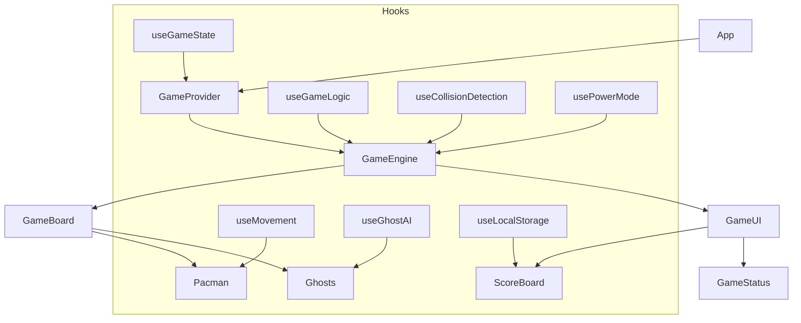

# AI Pacman (React + TypeScript + Vite)

An interactive, modern reimagining of the classic Pac‑Man built with React 19, TypeScript, Vite, and Tailwind CSS. This project highlights clean architecture with custom hooks, React Context for state, and a small but readable game engine with approachable AI pathfinding.

This repository is designed to be both fun to play and easy to read—showcasing product thinking, code quality, and engineering rigor.

<p>
  
  
  
  
  
</p>

---

## Why this project might interest engineering managers

- Clear separation of concerns: presentation components, state management, and game logic are decomposed into small, testable units.
- Pragmatic use of React and TypeScript: typed game models and hooks with minimal boilerplate.
- Demonstrates algorithmic thinking: ghost AI uses simple heuristics and pathfinding to create emergent gameplay.
- Production‑minded ergonomics: Vite dev/build, linting, Prettier, and a deployable static build.
- Traceability to product specs: the design, requirements, and task plan live in .kiro/specs to show intent, scope, and roadmap.

## Table of contents

- Getting started
- How to play
- Features
- Architecture overview
- Directory structure
- Scripts
- Deployment
- Roadmap (from .kiro/specs)
- Contributing and code style
- License and attribution

## Getting started

Prerequisites
- Node.js 18+ (recommended 18 or 20)
- npm (this repo includes a package-lock.json)

Install and run
- npm install
- npm run dev
- Open the printed local URL (typically http://localhost:5173)

Build and preview
- npm run build
- npm run preview

## How to play

- Use arrow keys or WASD to move Pac‑Man.
- Collect dots to increase score; power pellets enable eating ghosts for a short time.
- Avoid ghosts unless power mode is active. Lose all lives and it’s game over.
- Clear all dots to complete the round.

## Features

- Rich UI and HUD
  - ScoreBoard with current/high score, lives, rounds, and power mode timer
  - Game overlays for paused, game over, and victory states
- Game engine primitives
  - Central GameEngine orchestrates the loop, events, and state transitions
  - React Context + custom hooks for global game state
- Ghost AI (hooks)
  - useGhostAI with modes (chase, scatter, flee, eaten) and personalities
  - Simple pathfinding and Manhattan heuristics for responsive behavior
- Movement and collisions
  - Grid‑based movement, collision prevention against walls
  - Power mode and ghost consumption logic
- Styling
  - Tailwind utilities for layout and responsive spacing
  - CSS Modules for complex UI overlays and polished visuals

## Architecture overview

At a high level, components render the world, hooks encapsulate game mechanics, and a small engine coordinates updates and transitions.



Key files
- src/components/GameEngine.tsx — orchestrates the loop and state transitions
- src/components/GameBoard.tsx — renders maze, Pac‑Man, ghosts, and collectibles
- src/components/GameUI.tsx — overlays and status presentation
- src/hooks/useGhostAI.tsx — ghost modes, personalities, and movement
- src/context/gameContext.ts — global game context shape
- src/utils/mazeData.ts — maze layout and helpers

## Directory structure (selected)

```text
/ai-pacman
  ├─ .kiro/specs/css-pacman-game/
  │   ├─ design.md
  │   ├─ requirements.md
  │   └─ tasks.md
  ├─ src/
  │   ├─ components/        # GameEngine, GameBoard, UI, Ghost, Pacman, etc.
  │   ├─ context/           # Game context definition
  │   ├─ hooks/             # Movement, AI, power mode, game state
  │   ├─ styles/            # CSS modules for HUD and overlays
  │   ├─ types/             # TypeScript models (GameState, CellType, etc.)
  │   └─ utils/             # Maze data, scoring helpers, analysis
  ├─ vite.config.ts         # Vite config (base set for GH Pages)
  ├─ tsconfig.json
  ├─ package.json
  └─ README.md
```

## Scripts

- npm run dev — start the Vite dev server
- npm run build — type‑check and build for production
- npm run preview — preview the production build locally
- npm run lint — run ESLint

## Deployment

This is a static site that can be deployed to any static host (Vercel, Netlify, GitHub Pages, etc.). The Vite base is set to /ai-pacman/ for GitHub Pages.

GitHub Pages (manual)
1) Push the repository to GitHub
2) Build locally: npm run build
3) Serve the dist/ folder with any static host, or
4) Use a GH Pages action to publish dist/ to the gh-pages branch

(Optional) GitHub Action
- Add a workflow under .github/workflows/ to build and deploy the dist/ folder on push to main.

## Roadmap (from .kiro/specs)

This codebase tracks product intent and progress under .kiro/specs/css-pacman-game/.
- Completed
  - Core board, dots, power pellets, Pac‑Man rendering and movement
  - Keyboard controls, collision checks, scoring fundamentals
  - Ghost visuals and basic AI modes (chase/scatter/flee/eaten)
  - Power mode, overlays (game over, round/game complete), and polish passes
- In progress / planned
  - Performance optimizations and cross‑browser testing
  - Multi‑round progression and difficulty scaling
  - High‑score persistence and celebratory effects
  - Accessibility enhancements and responsive UX tuning
  - Additional symmetrical maze layouts and transitions

For full detail, see:
- ./.kiro/specs/css-pacman-game/design.md
- ./.kiro/specs/css-pacman-game/requirements.md
- ./.kiro/specs/css-pacman-game/tasks.md

## Contributing and code style

- TypeScript first: prefer explicit interfaces for game state and events
- React hooks: colocate logic in composable hooks (e.g., useGhostAI, useGameLogic)
- Linting and formatting: npm run lint, Prettier configured
- Commit style: conventional commits recommended (e.g., feat:, fix:, refactor:)

## License and attribution

License: TBD (choose an OSS license like MIT if open‑sourcing)

Pac‑Man is a trademark of Bandai Namco Entertainment Inc. This is a non‑commercial, educational project inspired by the original game.
